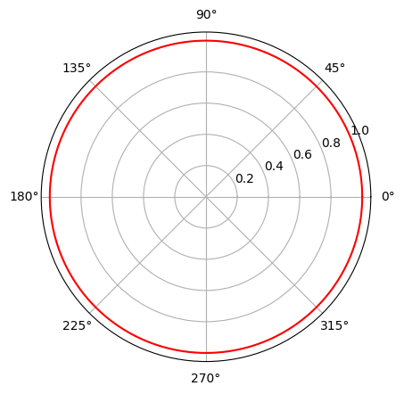
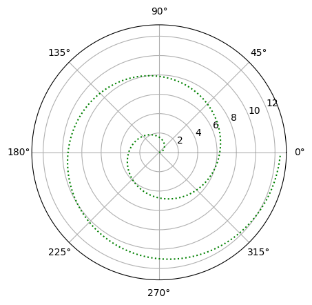
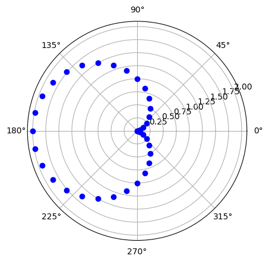

# plt.polar() 极坐标曲线图 / 极坐标方程

> 史胤隆 张依彤

`plt.polar(theta, r, options)`


通常，极坐标曲线图用于绘制极坐标方程，即极坐标曲线图的横坐标为角度，纵坐标为半径。很少有数据适合以极坐标形式绘制，因此，极坐标曲线图的使用场景很少。

python 中，极坐标曲线图的绘制使用`plt.polar()`函数，其参数`theta`为角度，`r`为半径，`options`为可选参数，用于设置曲线的颜色、线型、线宽等。具体使用方式很简单，只需要两个等长的可遍历对象，分别为角度和半径，然后将其作为参数传入`plt.polar()`函数即可。

需要注意的是，极坐标的角单位为弧度，而不是角度，因此，如果使用角度作为横坐标，需要将角度转换为弧度。

鉴于极坐标曲线图的使用场景很少，因此，本文不再给出示例代码，而是给出一个极坐标方程的绘制示例。


`options`参数的使用方法与`plt.plot()`函数的`options`参数的使用方法相同，例如：

- 'b' 蓝色
- 'c' 青绿
- 'g' 绿色
- 'k' 黑色
- 'm' 洋红
- 'w' 白色
- 'y' 黄色
- 'r' 红色
- '-' 实线
- '--' 虚线
- ':'  点线
- '-.' 点横线
- 'o' 实心圆

<div STYLE="page-break-after: always;"></div>

## 绘制圆的极坐标方程

```python
"""
圆的方程: rho = C
"""
import matplotlib.pyplot as plt #导入绘图模块
import math #导入数学模块
 
thetas = [math.pi/180*i for i in range(0, 361)] #生成角度列表
rhos = [1] * 361

fig = plt.figure() #新建画布
plt.polar(thetas, rhos, "r-") #极坐标画图
plt.show()

```



    

<div STYLE="page-break-after: always;"></div>

## 绘制简单螺线的极坐标方程

```python
"""
简单螺线方程: rho = theta
"""
import matplotlib.pyplot as plt #导入绘图模块

thetas =[] #用来存放极角
rhos = [] #用来存放极径

for i in range(0, 721):
    theta = i*math.pi/180 #角度转弧度
    rho = theta
    thetas.append(theta)
    rhos.append(rho)

fig = plt.figure() #新建画布
plt.polar(thetas, rhos, "g:") #极坐标画图
plt.show()

```



    

<div STYLE="page-break-after: always;"></div>

## 绘制心形线的极坐标方程

```python
"""
心形线方程: rho = 1 - cos(theta)
"""

import matplotlib.pyplot as plt #导入绘图模块
import math #导入数学模块
 
thetas =[] #用来存放极角
rhos = [] #用来存放极径
 
for i in range(0, 361, 10):
    theta = i*math.pi/180 #角度转弧度
    rho = 1- math.cos(theta) #极径
    thetas.append(theta)
    rhos.append(rho)
 
fig = plt.figure() #新建画布
plt.polar(thetas, rhos, "bo") #极坐标画图
plt.show()

```



    

